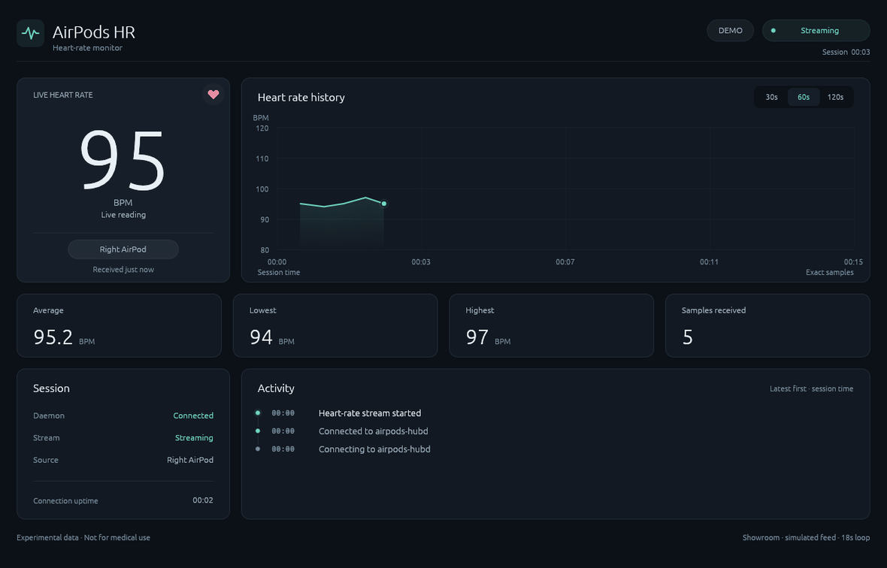

# Linux Client for AirPods Pro

An open-source Linux client for accessing data from compatible AirPods Pro devices.



## About

The current implementation reads heart-rate data from AirPods Pro 3 and shares
it with local applications. It includes a desktop app, command-line tools, and
Rust, Python, and C interfaces.

The Bluetooth protocol is reverse-engineered. Real AirPods Pro 3 testing has
covered streaming, multiple clients, disconnect/reconnect recovery, and clean
shutdown. Other models and firmware remain unvalidated.

## Features

- A persistent Linux daemon that owns the Bluetooth session.
- Exact BPM readings, including repeated values and source-side information.
- Rust and Python client APIs over a local Unix socket.
- A C-compatible interface for native applications.
- A Rust desktop app with live history, statistics, and connection events.
- Automatic local daemon setup for the desktop app.
- A deterministic demo that needs no AirPods or daemon.
- A self-contained x86_64 AppImage, built and validated locally for release review.

## Architecture

```text
AirPods Pro
    ↓
airpods-hubd — BlueZ / Linux Bluetooth
    ↓
Same-user Unix socket IPC
    ↓
Rust / Python / C clients → Desktop app and CLI
```

The daemon owns the Bluetooth connection so multiple clients can consume the
same stream without opening separate hardware sessions. Clients subscribe to
heart-rate events; they do not pair devices or manage the AirPods session.

The Python runtime handles Linux I/O and cleanup. Rust handles packet parsing
and pure state rules through a private native extension. The desktop app uses
`airpods-client-resilient` and keeps socket waits off the GUI thread.

Daemon recovery handles hardware interruptions. The optional resilient client
handles IPC disconnects separately. Neither changes the incoming BPM values.

## Installation

Version 0.1.0 has not been published to PyPI or crates.io yet.
You can build the project from source or run the local test suite.

### From source

You need Linux, Rust/Cargo, a C linker, and the desktop development libraries
for X11/Wayland and xkbcommon. Real mode also needs Python 3.14, BlueZ, and a
systemd user session. First setup may need network access for uncached Python
dependencies. Rust 1.97.0 is the currently validated toolchain.

Clone the repository and build:

```console
git clone https://github.com/ozankenangungor/linux-client-for-airpods-pro.git
cd linux-client-for-airpods-pro
```

Pair AirPods once through normal Linux Bluetooth settings, then run:

```console
cargo run --locked -p airpods-desktop
```

The app prepares and starts its local daemon when needed. Normal desktop use
requires no manual systemd setup. An existing usable daemon is reused; foreign
service definitions are left unchanged.

For a hardware-free demo:

```console
cargo run --locked -p airpods-desktop -- --demo
```

Demo mode uses a scripted stream with a connection loss and recovery. It does
not inspect Python, touch the daemon socket, or install a service.

### AppImage

The initial distribution target is x86_64 Linux with glibc 2.34 or newer.
A reviewed AppImage contains the GUI, Python 3.14, the daemon, and its dependencies.
It needs no host Python, pip, Rust, Cargo, checkout, or first-run downloads.

For a review artifact, replace `SOURCE_SHA` with its recorded source commit:

```console
chmod +x AirPods-HR-review-SOURCE_SHA-x86_64.AppImage
./AirPods-HR-review-SOURCE_SHA-x86_64.AppImage
```

Linux must still provide BlueZ, a systemd user session, working FUSE, and
compatible graphics drivers. Pair AirPods in Linux Bluetooth settings first.
The app saves a stable local copy for the separate daemon service; closing the
GUI does not stop the daemon. `--demo` skips that setup.

### Client APIs and CLI

Component layout and import references:

| Component | Location / name |
| --- | --- |
| Production Python package and daemon | `airpods-hr-linux`, import `airpods_hr` |
| Python SDK, Python 3.11–3.14, no runtime dependencies | [airpods-client](packages/airpods-client-python/README.md), import `airpods_client` |
| Rust SDK | [airpods-client](crates/airpods-client/README.md) |
| Optional Rust reconnect layer | [airpods-client-resilient](crates/airpods-client-resilient/README.md) |
| C interface | [airpods-client-c](crates/airpods-client-c/README.md) |
| CLI | [airpodsctl](crates/airpodsctl/README.md) |

Client libraries and the CLI require a running daemon. They do not start it.
The desktop application handles daemon setup separately.

With a daemon already running:

```console
cargo run --locked -p airpodsctl -- status
cargo run --locked -p airpodsctl -- watch --reconnect
cargo run --locked -p airpodsctl -- top
```

## Development

Run the Rust checks from the workspace root:

```console
cargo check --workspace --all-targets --locked
cargo test --workspace --locked
cargo run --locked -p airpods-desktop -- --demo
```

For Python development, build the native extension with the locked backend:

```console
python3.14 -m venv .venv
.venv/bin/python -m pip install -e . --config-settings=build-args=--locked
.venv/bin/python -m unittest discover -s tests -v
```

Routine tests use fake sessions and temporary sockets, not Bluetooth hardware.

## Limitations

- Physical validation covers AirPods Pro 3, not every AirPods Pro generation,
  firmware version, Bluetooth controller, or Linux distribution.
- Real mode requires compatible hardware and the Linux Bluetooth stack.
- The protocol and v0.1 APIs are experimental; future compatibility is not guaranteed.
- A targeted stale-connection refresh can briefly interrupt Bluetooth audio.
- BPM values are preserved as received, without medical interpretation or an
  accuracy guarantee. This is not a medical device.
- AppImage validation does not establish support for aarch64, musl, or every
  desktop environment.

## License

Original code is licensed under the [MIT License](LICENSE). AppImage dependencies
retain their own licenses and [notices](packaging/THIRD_PARTY_NOTICES.md).

AirPods and AirPods Pro are trademarks of Apple Inc. This project is independent
and is not affiliated with, endorsed by, or sponsored by Apple Inc.
